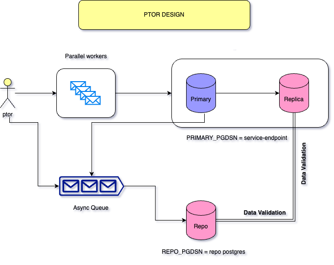

## Design
The `ptor` tool is designed to validate the `RPO`, `RTO` of a PostgreSQL HA instance. By using this tool, we can put some load into the primary instance, which will get replicated to it's secondary.

While the data loading happens, we can either turn off the primary or it's vm instance to trigger the underlying `auto failover` system. Once the `auto failover` happens, `ptor` tool will evaluate the `RPO(Data Loss)` and `RTO(Recovery Time)` of the HA system.

To use `ptor` tool, we need below two instances.

1. `PRIMARY_PGDSN` which points to the primary endpoint
2. `REPO_PGDSN` which makes a copy of the transactions, which parallel workers execute on the `PRIMARY_PGDSN`.
We need this `REPO_PGDSN` instance, to validate the data  after we trigger the failover/switchover.

## Quick Test

### Local
Quick test performed between the two local instance, where primary and repo instances are in `sync streaming` replication mode. In this demo, we restarted the local `primary` instance to mimic the `failover/switchover`.

## Other Demos
All the demos are done with a `sync streaming` replication between the primary and secondary nodes. All the instances are configured to be in the same network.

### pg_auto_failover
Configure `PRIMARY_PGDSN` as a `multi host` connection string as like below.

        host=host1,host2 port=5432,5432 user=postgres password=password target_session_attrs=read-write

[Demo Ptor pg_auto_failover](https://youtu.be/_0vhXn0HbWU)

### Stolon
Configure `PRIMARY_PGDSN` as to point the `stolon proxy`.

[Demo Ptor Stolon](https://youtu.be/SDriI00HNbM)

### Patroni
Configure `PRIMARY_PGDSN` as to point the `haproxy`.
Below is the `haproxy.cfg` used for this demo.

        global
        maxconn 100

        defaults
        log global
        mode tcp
        retries 1
        timeout client 30m
        timeout connect 1s
        timeout server 30m
        timeout check 1s

        listen stats
        mode http
        bind *:2361
        stats enable
        stats uri /

        listen production
        bind 172.31.46.52:2360
        option httpchk OPTIONS/master
        http-check expect status 200
        default-server inter 1s fall 1 rise 1 on-marked-down shutdown-sessions
        server postgresql_192.168.56.104_5432 172.31.34.9:5432 maxconn 100 check port 8008
        server postgresql_192.168.56.105_5432 172.31.43.176:5432 maxconn 100 check port 8008

[Demo Ptor Patroni, HaProxy](https://youtu.be/NoDMljx8_Q0)

## Installation

Below are the installation steps, which are prepared on RHEL instance. If you are using debain flavour, then use the platform specific package tools like `apt-get` or `brew` to install the below components.

1. Install `git`

        $ sudo yum install git -y

2. Install `golang`

        $ sudo yum install golang -y
        

3. Install `PostgreSQL server` (Optional)

        $ sudo yum install postgresql-server -y

    This is for the repo server, where we save a copy of primary transactions.

4. Download the copy of `ptor` source

        $ git clone git@github.com:dineshkumar02/ptor.git

5. Build the `ptor` binary

        $ cd ptor
        $ make

## Usage
| Option                 | Usage                                                                                                                     |
|------------------------|---------------------------------------------------------------------------------------------------------------------------|
| --repo-pgdsn           | The `repo` PostgreSQL connection string, where it syncs primary data.                                                     |
| --primary-pgdsn        | The primary or service PostgreSQL connection string, where we run switchover/failover.                                    |
| --parallel-workers     | Number of parallel workers to run data loading. It will create these many individual tables.                              |
| --init                 | Initialize the `paralle-workers` tables.                                                                                  |
| --reset                | Delete all data from `repo` and `primary` instances.                                                                      |
| --warmup-duration      | Initial data loading duration in seconds.                                                                                 |
| --insert-percent       | Percentage number of insert operations.                                                                                   |
| --update-percent       | Percentage number of update operations.                                                                                   |
| --delete-percent       | Percentage number of delete operations.                                                                                   |
| --full-data-validation | Run full data validation on both `repo` and `primary` in the end of the test case.                                        |
| --async-repo-mode      | All `primary` events will get in sync to `repo` asynchronously. This improves more data generation on the `primary` side. |
| --rto-conn-timeout           | `Primary` dns connection timeout value. This helps in calculating the `RTO` |
| --check-primary-latency      | Check network connectivity latency between `ptor` and  `primary` dns |